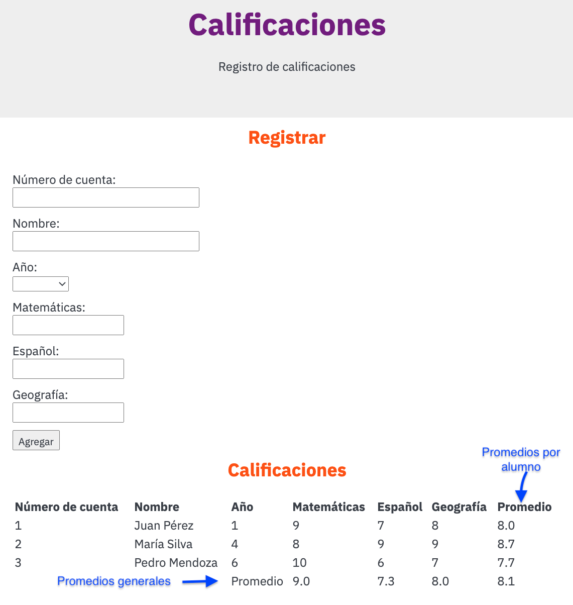

> Half Moon Bay, CA, USA. Photo by <a href="https://unsplash.com/@emerald_?utm_source=unsplash&utm_medium=referral&utm_content=creditCopyText">Noah Boyer</a> on <a href="https://unsplash.com/?utm_source=unsplash&utm_medium=referral&utm_content=creditCopyText">Unsplash</a>
  
# Tarea DOM: Calificaciones

El objetivo de este ejercicio es prácticar la interacción con HTML utilizando la api DOM de javascript

## Requerimientos funcionales

Programar una página web que permita a los usuarios agregar los la boleta de calificaciones de un estudiante de primaria.

- La página web contará con un formulario que permita al usuario capturar:

  - Número de cuenta del estudiante
  - Nombre del estudiante
  - Año escolar (primero a sexto)
  - Calificación de matemáticas
  - Calificación de español
  - Calificación de geografía

- La página web también mostrará una tabla con los siguientes datos:
  - Número de cuenta del estudiante
  - Nombre del estudiante
  - Año escolar (primero a sexto)
  - Calificación de matemáticas
  - Calificación de español
  - Calificación de geografía
  - Promedio de calificación, es decir el promedio de las 3 materias.

- Al final del listado o tabla se mostrarán los promedios para cada matería así como el promedio general como se muestra en la siguiente imágen.

> Ejemplo de la aplicación terminada.

1. (50 Puntos) Programar la clase `Grades`. Deberá incluir los siguientes:
   - Atributos:
     - `Number id` número de cuenta del estudiante.
     - `String name` nombre del estudiante.
     - `Number year` año o grado del estudiante.
     - `Number math` calificación que corresponde a la materia de Matemáticas
     - `Number spanish` calificación que corresponde a la materia de Español
     - `Number geography` calificación que corresponde a la materia de Geografía.
   - Métodos:
     - (10 puntos) `constructor()` recibe los valores iniciales para todos los atributos.
     - (10 puntos) `getAverage()` regresa el promedio de calificación para este alumno, es decir, la suma de las 3 calificaciones dividida entre 3.
     - (30 puntos) `static readForm()` obtiene la información capturada en el formulario y si todo es correcto regresa un nuevo objeto tipo `Grades` con la información obtenida en el formulario. En caso de que ocurra algún error regresa `false`. Todos los campos son requeridos, por lo que si el usuario no llena información en todos los campos, será considerado como un error.
     - Para obtener el año escolar en el formulario deberá utilizar un elemento HTML tipo [`select`](https://www.w3schools.com/tags/tag_select.asp)

2. (50 Puntos) Programar la clase `Record`. Deberá incluir los siguientes:
   - Atributos:
     - `Grades record[]` vector que guarda todos registros de calificaciones.
   - Métodos:
     - (10 puntos) `constructor()` inicia `record`
     - (20 puntos) `add(grades)` agrega un `grades` al vector `record`. Si el `grades` no está registrado se agrega y regresa `true`. Si ya está registrado no se agrega y regresa `false`. Dos `grades` son iguales si tienen el mismo `id`.En ambos casos la página web deberá mostrar una notificación (alert) dependiendo del caso.
     - (20 puntos) También, cuando se agrega un nuevo registro de calificaciones deberá mostrarse su información en una tabla dentro de la página web. La información que deberá mostrarse son: número de cuenta, nombre, año escolar, calificación de matemáticas, calificación de español, calificación de geografía y promedio (la suma de matemáticas, español y geografía dividida entre tres). También deberá actualizar los promedios generales para matemáticas, español, geografía y general.

## Requerimientos no funcionales

- Las clases, métodos y atributos deberán tener el nómbre que se indica y el número y tipo de parámetros que se especifica.
- Las clases deberán estar encapsuladas.
- Se deberán utilizar las convenciones de estilo para clases, métodos, atributos, parámetros y variables

## Entregable

- Código fuente en este repositorio
  
## Evaluación

- Para que la tarea sea considerada como válida, el repositorio deberá tener por lo menos 1 commit por cada método.
- Los repositorios que no tengan una historia de commits considerable NO serán considerados como válidos y obtendrán cero como calificación.
